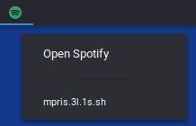
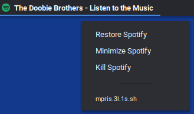

# argos-mpris

+ Displays currently playing Artist and Title from Spotify
+ Option to open Spotify when not running
+ Options to Restore (un-minimize), minimize, and kill Spotify when running





# Installation

1. Install the [Argos GNOME Shell extension](https://github.com/p-e-w/argos)
2. Install `wmctrl` and `xdotool` from your package manager. For Debian and Ubuntu based systems: `sudo apt install wmctrl xdotool`
3. Place all `.sh` files into the `~/.config/argos` directory and make them executable:
```bash
for file in ~/.config/argos/*.sh; do
	chmod +x $file
done
```
4. To change the position, rename the `mpris.3l.1s.sh` file, changing the second item (`3l`) according to the Argos specifications:
    + (optional) integer to specify the order (so `3` means third over)
    + `l`, `c`, or `r` for left, center, or right (respectively) of top bar.
    + See the [Argos Documentation](https://github.com/p-e-w/argos#filename-format) for more information.